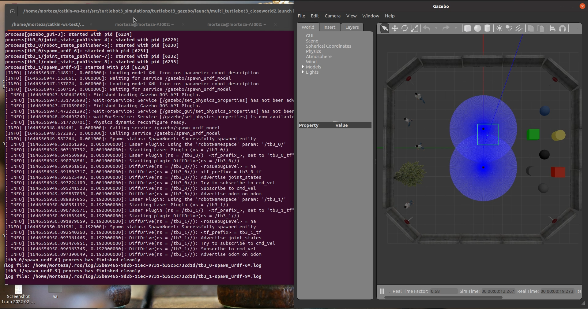
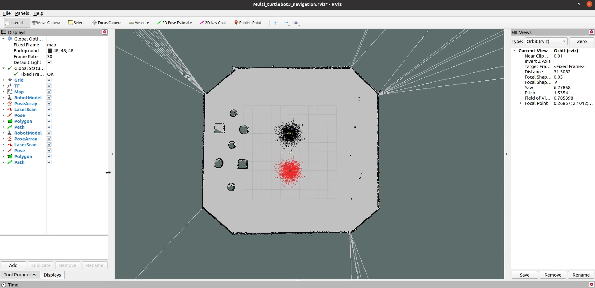
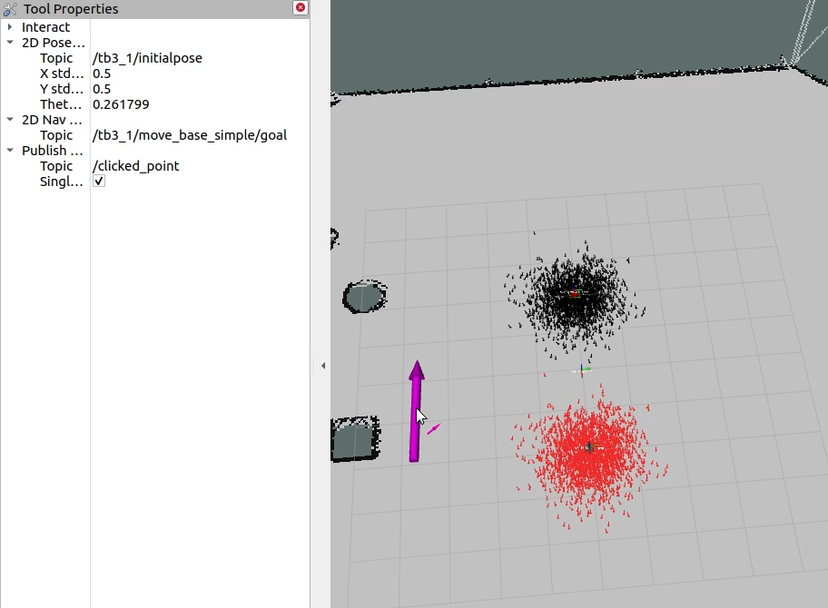

# 多机器人导航Gazebo仿真(Multi-Robot-Gazebo-NaviStack)


## 前言

写在开头，本仓库克隆于 [MortezaAliyari](https://github.com/MortezaAliyari) 的 **[Multi-Robot-Gazebo-NaviStack](https://github.com/MortezaAliyari/Multi-Robot-Gazebo-NaviStack)** 仓库项目，原作者在如下配置中进行了代码验证

- Ubuntu Focal 
- ROS Noetic
- GAzebo 11

原作者的原有工作可在仓库 main 分支中进行获取。

笔者将在 melodic 分支中进行测试与修改。


笔者测试平台

- Ubuntu 18.04
- ROS Melodic
- Gazebo 9


## 项目描述

这个仓库提供一个 Gazebo 仿真中的多移动机器人导航仿真。 基于导航元功能包，创建环境地图，场景中的每个机器人都能够进行独立运动规划。 

如果你喜欢这个项目可以给原作者与我一个小星星 :star: 

点击下方观看原作者的演示视频 &nbsp;&nbsp;
[](https://www.youtube.com/watch?v=XaLbEKf8UhA)


## ROS 依赖

```bash
$  sudo apt-get install ros-melodic-map-server
$  sudo apt-get install ros-melodic-navigation
$  sudo apt-get install ros-melodic-dwa-local-planner
$  sudo apt-get install ros-melodic-move-base
```


## 安装与测试（Installation）

<br/>

### **1 构建工作空间**

---
```bash
$  mkdir -p ~/catkin_ws/src
$  cd catkin_ws/src
$  git clone https://github.com/KairongWu/Multi-Robot-Gazebo-NaviStack.git -b $  melodic
$  cd ..
$  catkin_make
$  source devel/setup.bash
```
<br/>

### **2 修改地图参数**

进入功能包如下目录

```
/turtlebot3/turtlebot3_navigation/maps
```

修改 maps 文件夹中的 closeworld2map.yaml 文件

将其中第一行内容中地图的路径修改为本地的路径

```
image: /home/morteza/catkin-ws-test/src/turtlebot3/turtlebot3_navigation/maps/closeworld2map.pgm

to

image: /home/username/your_workspase/src/turtlebot3/turtlebot3_navigation/maps/closeworld2map.pgm
```

<br/>

### **3 启动仿真环境**

打开终端命令行并 source 工作空间，键入如下命令

 ```
roslaunch turtlebot3_gazebo multi_turtlebot3_closeworld2.launch
 ```

如果您没有看到错误，Gazebo 环境应该会启动。结果如下所示



<br/>

### **4 启动导航** 

打开新的终端并 source 工作空间，键入如下命令

 ```
roslaunch turtlebot3_navigation multi_turtlebot3_navigation.launch
 ```



<br/>

然后在“2D nav Goal”上单击鼠标右键并将“Tool Properties”作为新面板添加到 RVIZ。可在左侧面板左下角进行切换。
然后您可以将 2D nav Goal 主题更改为

- /tb3_0/move_base_simple/goal
- /tb3_1/move_base_simple/goal

如下图所示：




